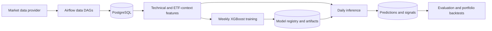

# Airflow XGBoost Market Signal Pipeline

An Apache Airflow pipeline for collecting US equity market data, calculating technical and market-context features, training XGBoost classifiers, generating daily signals, and evaluating strategies with walk-forward and capital-constrained backtests.

> **Research software only.** This repository does not place broker orders and is not financial advice. Historical performance does not guarantee future results.

## Features

- Maintains an S&P 500 and Nasdaq-100 ticker universe.
- Loads daily, intraday, ETF, and overnight market bars.
- Calculates technical indicators, support/resistance, volatility, and relative strength.
- Adds SPY, QQQ, and sector-ETF market context.
- Separates weekly model training from daily inference.
- Produces independent 7-session and 20-session forward-return signals.
- Runs leakage-aware walk-forward, exit-policy, and portfolio backtests.
- Stores predictions, signals, model metadata, trades, equity curves, and metrics in PostgreSQL.

## Architecture



The production-test candidate is the baseline `xgb_forward_v2` model. Expanded-context and DOWN/SHORT models remain research-only because they did not pass longer robustness and portfolio tests.

## Core production-test DAGs

Filter Airflow by the `production` tag.

| DAG | Schedule | Purpose |
| --- | --- | --- |
| `tickers_massive_sp500_qqq` | Sunday 09:00 | Refresh ticker metadata and index membership. |
| `spy_daily_scan` | Weekdays 16:30 ET | Load the completed daily US market session. |
| `stock_indicators_dag` | Weekdays 22:00 UTC | Build 120-day and 240-day feature tables. |
| `eod_xgb_forward_train_weekly` | Sunday 18:00 ET | Train and register production model pairs. |
| `eod_xgb_forward_predict_daily` | Weekdays 08:30 and 17:00 ET | Load registered models and perform inference only. |
| `eod_xgb_eval_metrics_daily_morning` | Weekdays 09:15 ET | Store quality and calibration metrics. |

Recommended dependency order after a completed market session:

```text
spy_daily_scan
  -> stock_indicators_dag
  -> eod_xgb_forward_train_weekly    # weekly only
  -> eod_xgb_forward_predict_daily
  -> eod_xgb_eval_metrics_daily_morning
```

The DAGs currently have independent schedules. Before unattended deployment, coordinate them with Airflow dependencies or verify that each upstream run completed successfully.

## Intraday and risk data

These DAGs are tagged `production-support` and `risk-data`. They support monitoring but are not direct inputs to the daily XGBoost model.

| DAG | Schedule | Purpose |
| --- | --- | --- |
| `intraday_sp500_qqq_10min` | Every 10 minutes, weekdays 08:00–16:59 ET | Update constituent intraday bars. |
| `intraday_etfs_10min` | Every 10 minutes, weekdays 08:00–16:59 ET | Update ETF intraday bars. |
| `overnight_volume_scan` | Weekdays 05:00 and 08:00 ET | Load overnight and pre-market bars. |
| `cleanup_market_data` | Daily | Enforce configured retention windows. |

The planned ticker-risk API and top-20 risk report are warning layers only. They should not submit orders or override validated portfolio rules.

## Setup and backfill DAGs

Keep these paused and trigger them only when required:

| DAG | Purpose |
| --- | --- |
| `db_schema_bootstrap` | Create or upgrade the PostgreSQL schema. |
| `daily_market_summary_manual_4y` | Backfill up to four years of daily bars. |
| `daily_market_summary_today` | Manually load a completed session. |
| `fetch_sp500_qqq_historical_data` | Backfill constituent intraday bars. |
| `fetch_etfs_historical_data` | Backfill ETF intraday bars. |
| `backfill_intraday_selected_tickers` | Run an ad-hoc selected-ticker backfill. |
| `test_postgres_connection` | Test database connectivity from Airflow. |

## Research-only DAGs

Filter Airflow by `research`. These DAGs remain separate from production inference and artifacts.

- `eod_xgb_forward_walkforward_backtest`
- `eod_xgb_forward_context_challenger_backtest`
- `eod_xgb_forward_7d_robustness_backtest`
- `eod_rule_based_exit_breakout_backtest`
- `eod_xgb_portfolio_backtest`
- `eod_xgb_portfolio_sizing_comparison`
- `eod_xgb_challenger_portfolio_comparison`
- `eod_xgb_down_risk_filter_backtest`
- `eod_xgb_7d_robustness_portfolio_comparison`
- `eod_xgb_short_portfolio_backtest`
- `eod_xgb_tb_backtest`

The triple-barrier strategy is an independent experimental model family. Do not mix its registry names, artifacts, predictions, or signals with the forward-return strategy.

## Main tables

| Table | Contents |
| --- | --- |
| `tickers_info` | Ticker metadata and index membership. |
| `ticker_sector_map` | Stock-to-sector-ETF mapping. |
| `daily_market_summary` | Daily OHLCV and VWAP data. |
| `intraday_data` | Intraday and overnight bars. |
| `daily_features_120d` | Seven-session features and forward labels. |
| `daily_features_240d` | Twenty-session features and forward labels. |
| `model_registry` | Model versions, feature contracts, paths, and training metadata. |
| `model_predictions` | Per-ticker UP/DOWN probabilities. |
| `daily_trade_signals` | Production signal decisions. |
| `backtest_trade_signals` | Isolated research signals. |
| `forward_backtest_results` | Cost-adjusted walk-forward outcomes. |
| `portfolio_backtest_runs` | Portfolio-level summaries. |
| `portfolio_backtest_daily` | Daily cash, exposure, equity, and drawdown. |
| `portfolio_backtest_trades` | Simulated entries, exits, costs, and returns. |

Schema definitions are maintained in `db_bootstrap_schema.py`. Standalone XGBoost DDL is available in `xgboost_tables_ddl.sql`.

## Configuration

Copy `.env.example` to a private environment file managed outside Git. At minimum, configure:

```dotenv
MARKET_API_KEY=replace_with_your_provider_key
POSTGRES_HOST=postgres
POSTGRES_PORT=5432
POSTGRES_DB=trading
POSTGRES_USER=postgres
POSTGRES_PASSWORD=replace_with_a_strong_password
MODEL_DIR=/opt/airflow/data/models
```

Useful optional controls include:

- `FEATURE_RETENTION_TRADING_DAYS`
- `FEATURE_SOURCE_CALENDAR_DAYS`
- `TRAIN_LOOKBACK_DAYS`
- `MIN_TRAIN_ROWS`
- `BUY_UP_PROB`
- `SELL_DOWN_PROB`
- `SIGNAL_TOPN`
- `FORWARD_BACKTEST_DAYS`
- `FORWARD_BACKTEST_RETRAIN_DAYS`
- `FORWARD_BACKTEST_COST_BPS`
- `PORTFOLIO_BACKTEST_INITIAL_CAPITAL`
- `PORTFOLIO_BACKTEST_MAX_POSITIONS`
- `PORTFOLIO_BACKTEST_MAX_POSITION_PCT`
- `PORTFOLIO_BACKTEST_COST_BPS_PER_SIDE`
- `PORTFOLIO_BACKTEST_SLIPPAGE_BPS_PER_SIDE`

## Initial run

This folder is intended to be mounted as the Airflow DAG directory.

For container build instructions and the recommended private-configuration
layout, see [Docker Setup](DOCKER_SETUP.md).

1. Create a private environment file from `.env.example`.
2. Start PostgreSQL and Airflow using your deployment configuration.
3. Trigger `db_schema_bootstrap` once.
4. Trigger `daily_market_summary_manual_4y` for initial history.
5. Trigger `stock_indicators_dag`.
6. Trigger `eod_xgb_forward_train_weekly`.
7. Trigger `eod_xgb_forward_predict_daily`.
8. Verify predictions and signals before enabling schedules.

## Validation principles

- Training labels are cut off before every scoring date.
- Walk-forward models retrain on a fixed historical cadence.
- Production and research model names and tables are separated.
- Portfolio simulations include whole shares, capital limits, overlapping holdings, costs, slippage, and SPY/QQQ benchmarks.
- BUY, EXIT, and SHORT decisions are evaluated separately.
- DOWN/SHORT output remains research-only after failing dedicated backtests.
- The expanded-context challenger remains research-only after underperforming the baseline over the longer test.

## Security before publishing

- Never commit `.env`, `stocks.env`, Vault data, Airflow logs, model artifacts, database volumes, or credentials.
- Rotate any key previously stored in plaintext, even if it is removed before the first public commit.
- Replace development passwords and Airflow cryptographic keys before exposing services.
- Enable GitHub secret scanning and push protection.
- Review staged files with `git diff --cached` before every public push.

## Known limitations

- The market-data provider may time out or rate-limit large scans.
- The overnight scanner currently requests all active tickers and needs hardening before unattended use.
- Current-index membership can introduce survivorship bias into historical research.
- Borrow availability is assumed in SHORT research simulations.
- Results depend on data quality, corporate-action adjustments, liquidity, costs, and execution assumptions.
- This repository does not include broker execution or live-order safeguards.

## License

Licensed under the [Apache License 2.0](LICENSE).
